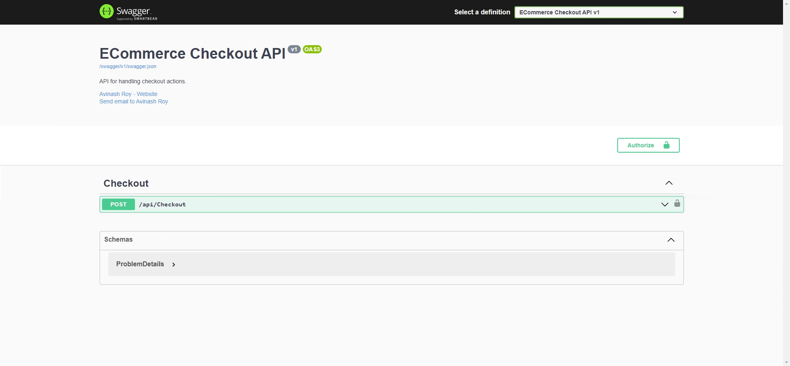

# E-Commerce Checkout API

## Introduction

E-Commerce Checkout API is a simplified e-commerce API that provides a single endpoint for performing a checkout action. The API takes a list of watch IDs and calculates the total cost of the watches in the cart based on the provided catalogue.

## Watch Catalogue

Below is the catalogue of four watches available in the system, along with their associated prices and discount information:

| Watch ID | Watch Name     | Unit Price | Discount Quantity | Discount Price |
|----------|----------------|------------|-------------------|----------------|
| 001      | Rolex          | $100       | 3                 | $200           |
| 002      | Michael Kors   | $80        | 2                 | $120           |
| 003      | Swatch         | $50        | 0                 | $0             |
| 004      | Casio          | $30        | 0                 | $0             |

## Requirements

- The first two products (Rolex and Michael Kors) have possible discounts. For example, if the user checks out three or six Rolex watches, they will receive the discounted price once or twice, respectively.
- There is no limit to the number of items or combinations of watches a user can checkout.
- There is no limit to the number of times a discount can be used.
- A user can checkout a single item if they wish.

## Endpoint Reference

To perform the checkout action, use the following endpoint:

**Request**

```
POST https://localhost:44361/api/Checkout
```

**Headers**

```
Accept: application/json
Content-Type: application/json
Authorization: ApiKey YOUR_API_KEY (For Test : 123)
```

**Body**

```json
[
 "001",
 "002",
 "001",
 "004",
 "003"
]
```

**Body**

```json
{
  "TotalPrice": 360
}
```

## Local Setup and Running the API

Follow the steps below to set up and run the API:

1. Clone the repository to your local machine.

2. Open the solution in Visual Studio.

3. Restore the NuGet packages by right-clicking on the solution and selecting "Restore NuGet Packages".

4. Build the solution by right-clicking on the solution and selecting "Build".

5. Run the API project by pressing F5 or selecting "Start Debugging" from the "Debug" menu.

The API will be up and running at `https://localhost:44361/api/Checkout`.

## Swagger Documentation

The API includes Swagger documentation for easy exploration of the endpoints. After running the API, you can access the Swagger UI by navigating to the following URL in your web browser:

```
http://localhost:44361/swagger/index.html

```

The Swagger UI provides an interactive way to interact with the API's endpoints and test the functionality.